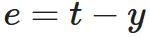
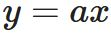
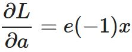
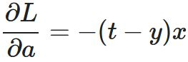
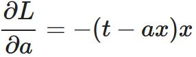
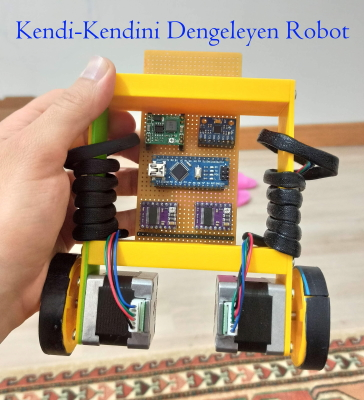

# 1-dimensional Optimization Problem
# Numerical Solution
## Introduction
We have captured sensor data with Arduino as can be seen in *Fig. 1*. Here x axis can be considered to represent time in seconds.</br>
*Şekil 1*'de görüldüğü gibi Arduino ile sensör verisi yakaladık. Burada x ekseninin saniye cinsinden zamanı temsil ettiği düşünülebilir.

</br>
*Figure 1:* Data captured with an Arduino-sensor pair.</br>
*Şekil 1:* Arduino-sensör ikilisi ile yakalanan veri.</br>

*MATLAB script for reading and plotting data*
```
load('data.txt');
xdata = data(:,1); tdata = data(:,2);
plot(xdata, tdata, 'k.');
```
*Python script for reading and plotting data*
```
xdata = np.array([[-5],[-4.5],[-4],[-3.5],[-3],[-2.5],[-2],[-1.5],[-1],[-0.5],[0],\
                  [0.5],[1.0],[1.5],[2.0],[2.5],[3.0],[3.5],[4.0],[4.5],[5.0]],"float32")
tdata = np.array([[-6.5930],[-6.6869],[-4.8374],[-6.4320],[-3.7876],[-5.5401],[-1.7953],\
                  [-1.5357],[0.2840],[-2.3838],[1.6338],[0.7898],[1.9596],[1.5143],\
                  [1.3099],[5.1525],[3.0781],[4.7319],[6.4896],[8.7402],[7.5694]],"float32")
```

We would like to develop a model for the data shown in *Fig. 1*. If we cannot predict the (mathematical) structure of the model by examining the data, then it is referred to as a **black-box** model. No matter what the model is, we are going to formulate this **model fitting** problem with Least Squares method and Gradient-Descent algorithm here. The approach for building a model for the captured daha is illustrated in *Fig. 2*.

</br>
*Figure 2:* Black-box model for the data captured in *Fig. 1*.

If we look at the data in *Fig. 1* carefully, we see that the points can be represented with a line (in the form of y = ax + b). If we further examine the axes and data together, we see that the line actually passes through 0, which simplifies the line equation (i.e., our model) to y = ax. Eventually, *Fig. 2* is updated to *Fig. 3*.

</br>
*Figure 3:* Anticipated model for the data captured in *Fig. 1*.
## Least Squares
Now, let's formulate this problem with a technique called **Least Squares**. If we minimize the error for each data point, then we obtain the correct parameters and the model. In least squares, because of the input-target data size (multi-dimensional), we minimize the sum of errors in order to optimize the adjustable (sought) parameters. Unfortunately, this yields to an undesired result in the case of errors cancelling each other and sometimes despite having zero total error, obtained model is irrelevant. To avoid this issue, instead of summing the errors, we sum the *squared* errors, which actually names the technique of **Least Squares**. If we are able to minimize the sum of squared errors, then we achieve the **least squares** literally :thumbsup: Now let's start formulating the problem by defining the loss function L (that is aimed to be minimized) as</br>
</br>
Here, the loss function L depends on the error e, which is defined (according to the formulation shown in *Fig. 3*) as</br>
</br>
The output of our model y is defined as</br>
</br>
We see that the loss function has a dependency on the model parameter through a chain of equations given above. Our goal here is to utilize this relationship within an iterative approach to find the **optimal**<sup>1</sup> value for the parameter.
## Gradient-Descent
We have derived the relationship between the loss function L and the model parameter a and now we are going to use it in an optimization algorithm called Gradient Descent as</br>
</br>
in order to determine the correct value for the parameter a step by step (i.e., iteratively). The partial derivative term in the equation of the Gradient-Descent algorithm for the 1-d optimization problem given above can explicitly be written as</br>
</br>
and if we replace each partial derivative term with the corresponding terms, we get</br>
</br>
If we make substitutions, we obtain</br>
</br>
and</br>
</br>
and eventually the final form of the Gradient-Descent algorithm for our problem is achieved.</br>
</br>
Here the script k refers to the iterations; it varies from k=0 to k=7x21 where 7 is the epoche number and 21 is the size (length) of the input-target data as can be seen in the x-axes of the plots in *Fig. 4* and *Fig. 5*. Now we initialize the model parameter a as a<sub>0</sub>=10<sup>2</sup> run the gradient-descent formula derived above and see the drop in the loss function L (*Fig. 4*) and convergence of the parameter a to the optimal value (*Fig. 5*).

</br>
*Figure 4:* Loss function.

</br>
*Figure 5:* Searching for the optimal value of parameter a.

*MATLAB script for initialization of Gradient Descent*
```
a0 = 10 % başlangıç değeri
n = 7; % epoch sayısı
a = a0;
alpha = 0.005; % adım büyüklüğü - step size
ahistory = zeros(1, n*length(xdata)+1); % parametre arayışının yolculuğunu kaydedelim
ahistory(1) = a0; % for k=0 the parameter starts from a0
% compute the L value for k=0
lossFunction = zeros(1, n+1); % her bir epoche bittiğinde kayıp fonksiyonunu hesapla
for i=1:length(xdata)
    lossFunction(1) = lossFunction(1) + 0.5*(tdata(i)-a*xdata(i))^2;
end
```

*MATLAB script for implementation of Gradient Descent - 1d Optimization Problem*
```
for i=1:n % epoch numarası
    for j=1:length(xdata) % batch'deki her bir veriyi tek tek giriş olarak veriyoruz
        a = a + alpha*(tdata(j)-a*xdata(j))*xdata(j); % eğim düşümü yöntemi (gradient descent) ile parametreyi güncelliyoruz
        ahistory((i-1)*length(xdata)+j) = a;
        lossFunction(i+1) = lossFunction(i+1) + 0.5*(tdata(j)-a*xdata(j))^2;
    end
end
```

*Python script for 1d Optimization Problem*
```
n = 7
a0 = 10 # başlangıç değeri (initial value for parameter a)
a = a0
alpha = 0.005; # adım büyüklüğü - step size
i = 1 # index for epoch number
while i <= n:
  for j, x in enumerate(xdata):
    a = a + alpha*(tdata[j]-a*x)*x # eğim düşümü yöntemi (gradient descent) ile parametreyi güncelliyoruz
  i = i + 1
```

Eventually, the final value of the parameter a is obtained approximately as a ≈ 1.52 as can be seen in *Fig. 5*. Now, we have the correct model and if we plot it, which is y = ax line mentined before, then we obtain the result in *Fig. 6*.

</br>
*Figure 6:* Line fit with gradient descent algorithm.
# Analytic (Closed-Form or Mathematical) Solution
xa = t

x<sup>T</sup>xa = x<sup>T</sup>t

a = (x<sup>T</sup>x)<sup>-1</sup>x<sup>T</sup>t

# Overall Picture
The overall picture of the 1d optimization problem is visualized in *Fig. 7*.

</br>
*Figure 7:* One dimensional optimization problem with **least squares** and **gradient descent** formulation [1].
## Footnotes
<sup>1</sup> **Optimal** means *the best* according to the data and the anticipated model.</br>
<sup>2</sup> The initial value for the parameter(s) can be assigned arbitrarily. Generally the initialization is made in an random manner.
## References
[1] Emojis in github - https://gist.github.com/rxaviers/7360908
## Video
Please watch the video below to see how this page is built (click on the image).</br>
[](https://www.youtube.com/watch?v=bkvXMme4lFs&t=743s)
